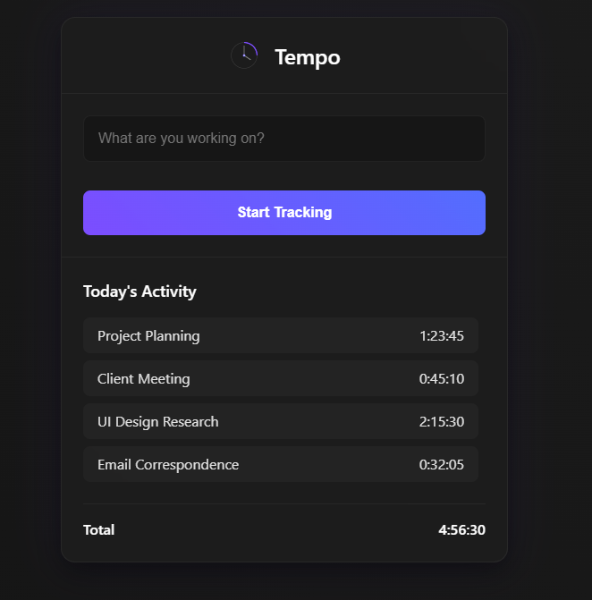

# Tempo - Minimal Time Tracking App

## Overview

Tempo is a sleek, minimalist time tracking web application designed for professionals who need to monitor their daily activities efficiently. With its intuitive interface and streamlined functionality, Tempo helps you keep track of your time without getting in your way.

## Features

- **Simple Task Tracking**: Enter what you're working on and start tracking with one click
- **Real-time Timer**: Visual display of time spent on current tasks
- **Daily Activity Log**: Automatically records and displays all tracked activities
- **Daily Totals**: Automatically calculates total time spent across all activities
- **Keyboard Shortcuts**: Ctrl+Enter or Alt+Enter to start/stop tracking for improved workflow
- **Responsive Design**: Works seamlessly across desktop and mobile devices

## Design Philosophy

Tempo features a modern interface with subtle purple accents. A built-in toggle lets you switch between dark and light themes, helping reduce eye strain in any environment. The minimalist approach ensures that you focus on your work, not on the tool tracking it.

## Accessibility Features

- Full keyboard navigation support
- Screen reader compatible with ARIA attributes
- High contrast mode support
- Focus states for all interactive elements
- Live announcements for tracking status changes

## Technical Details

- Built with vanilla HTML, CSS, and JavaScript
- No external dependencies or frameworks required
- Lightweight and fast-loading
- Optimized for performance and low resource usage

## Getting Started

TBD

## Future Enhancements

- Data persistence with local storage
- Task categorization and tagging
- Reporting and analytics
- Export capabilities (CSV, PDF)
- Team collaboration features

---

© 2025 Tempo | [GitHub Repository](#)